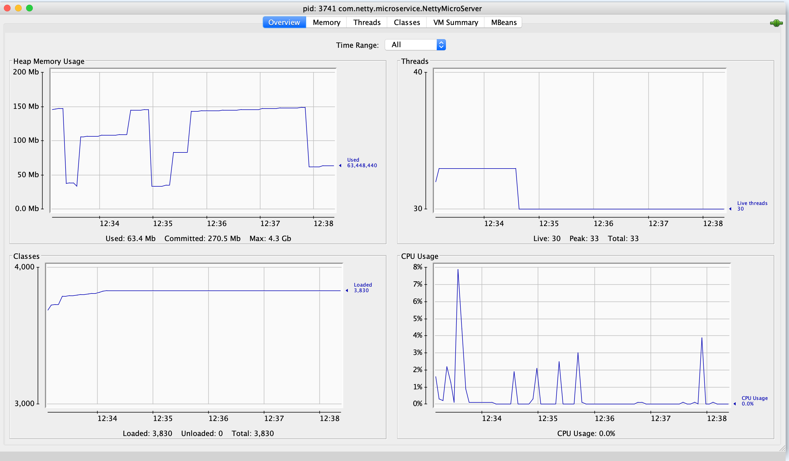

netty microservice
-----------------

```bash
cd server
gradle run
```

```bash
$ curl -v localhost:9090
*   Trying ::1...
* TCP_NODELAY set
* Connected to localhost (::1) port 9090 (#0)
> GET / HTTP/1.1
> Host: localhost:9090
> User-Agent: curl/7.64.1
> Accept: */*
> 
< HTTP/1.1 200 OK
< content-type: application/json
< content-length: 67
< 
* Connection #0 to host localhost left intact
{"applicationName":"netty-microservice","applicationVersion":"1.0"}* Closing connection 0
```

perf
----

```bash
ab -n 25000 -c 100 -k http://localhost:9090/
This is ApacheBench, Version 2.3 <$Revision: 1843412 $>
Copyright 1996 Adam Twiss, Zeus Technology Ltd, http://www.zeustech.net/
Licensed to The Apache Software Foundation, http://www.apache.org/

Benchmarking localhost (be patient)
Completed 2500 requests
Completed 5000 requests
Completed 7500 requests
Completed 10000 requests
Completed 12500 requests
Completed 15000 requests
Completed 17500 requests
Completed 20000 requests
Completed 22500 requests
Completed 25000 requests
Finished 25000 requests


Server Software:        
Server Hostname:        localhost
Server Port:            9090

Document Path:          /
Document Length:        67 bytes

Concurrency Level:      100
Time taken for tests:   0.320 seconds
Complete requests:      25000
Failed requests:        0
Keep-Alive requests:    25000
Total transferred:      4050000 bytes
HTML transferred:       1675000 bytes
Requests per second:    78120.36 [#/sec] (mean)
Time per request:       1.280 [ms] (mean)
Time per request:       0.013 [ms] (mean, across all concurrent requests)
Transfer rate:          12358.89 [Kbytes/sec] received

Connection Times (ms)
              min  mean[+/-sd] median   max
Connect:        0    0   0.2      0       4
Processing:     0    1   0.5      1       9
Waiting:        0    1   0.5      1       9
Total:          0    1   0.6      1       9

Percentage of the requests served within a certain time (ms)
  50%      1
  66%      1
  75%      1
  80%      1
  90%      2
  95%      2
  98%      2
  99%      3
 100%      9 (longest request)
 ```
 


Also see
-----

- https://github.com/prayagupd/eccount-rest-nio
- https://github.com/prayagupd/eccount-rest