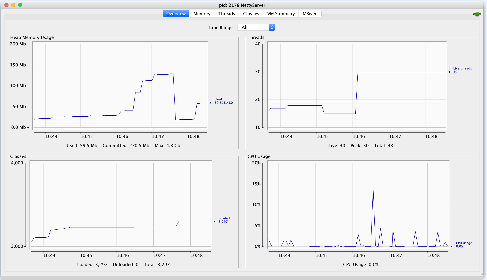

netty microservice
-----------------

```bash
cd server
gradle run
```

```bash
$ curl -v localhost:9090
*   Trying ::1...
* TCP_NODELAY set
* Connected to localhost (::1) port 9090 (#0)
> GET / HTTP/1.1
> Host: localhost:9090
> User-Agent: curl/7.64.1
> Accept: */*
> 
Warning: Binary output can mess up your terminal. Use "--output -" to tell 
Warning: curl to output it to your terminal anyway, or consider "--output 
Warning: <FILE>" to save to a file.
* Failed writing body (0 != 8)
* Closing connection 0
```

perf
----

```bash
ab -n 10000 -c 100 -k http://localhost:9090/
This is ApacheBench, Version 2.3 <$Revision: 1843412 $>
Copyright 1996 Adam Twiss, Zeus Technology Ltd, http://www.zeustech.net/
Licensed to The Apache Software Foundation, http://www.apache.org/

Benchmarking localhost (be patient)
Completed 1000 requests
Completed 2000 requests
Completed 3000 requests
Completed 4000 requests
Completed 5000 requests
Completed 6000 requests
Completed 7000 requests
Completed 8000 requests
Completed 9000 requests
Completed 10000 requests
Finished 10000 requests


Server Software:        
Server Hostname:        localhost
Server Port:            9090

Document Path:          /
Document Length:        0 bytes

Concurrency Level:      100
Time taken for tests:   2.312 seconds
Complete requests:      10000
Failed requests:        0
Keep-Alive requests:    0
Total transferred:      0 bytes
HTML transferred:       0 bytes
Requests per second:    4326.08 [#/sec] (mean)
Time per request:       23.116 [ms] (mean)
Time per request:       0.231 [ms] (mean, across all concurrent requests)
Transfer rate:          0.00 [Kbytes/sec] received

Connection Times (ms)
              min  mean[+/-sd] median   max
Connect:        0    0   0.0      0       4
Processing:     0    0   5.3      0     527
Waiting:        0    0   0.0      0       0
Total:          0    0   5.3      0     527

Percentage of the requests served within a certain time (ms)
  50%      0
  66%      0
  75%      0
  80%      0
  90%      0
  95%      0
  98%      0
  99%      0
 100%    527 (longest request)
 ```
 


Also see
-----

- https://github.com/prayagupd/eccount-rest-nio
- https://github.com/prayagupd/eccount-rest